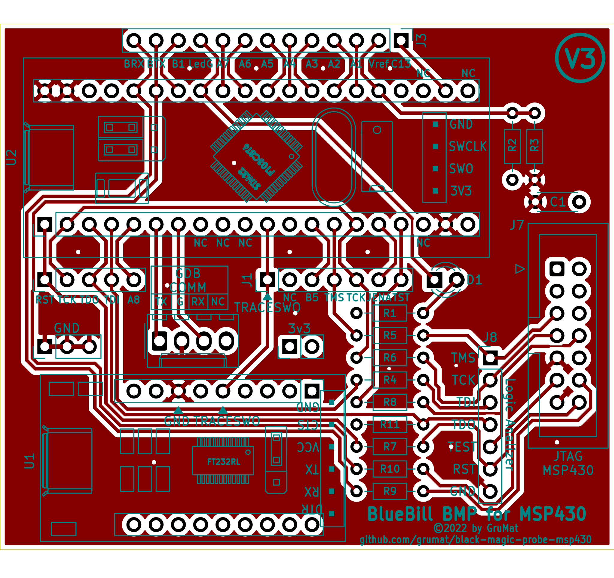

# Initial Hardware Development using STM32 BluePill #

For the development of the project we need access to the hardware pins and components. So, one of the easiest way to go is the *STM32F103 Blue Pill*.

This is a really cheap and powerful solution. The chip offers following advantages if compared to other 8 or 16-bit cheap modules:

- Unbeatable price/performance
- Lots of documentation and community support
- Higher clock rates when compared to MSP430 alternatives
- Lots of interface pins
- Possibility to *bit-bang* pin at a rate near 10 MHz, which is the upper limit of the MSP430 JTAG interface
- A SPI peripheral, also able to run on those high clock speeds, which is a real alternative to the *bit bang* option
- Possibility to timer a DMA to bit bang GPIO port at these high rates (clock generation for the Flash erase command).
- Integrated USB port to implement a VCP.

> Note that using the *Blue Pill* you are at a fixed supply
> rate of 3.3V, which may not be compatible to all MSP430
> designs out there.

## Feature Description

The Bluepill prototype has the following features:
- SPI2 pins is used as communication port allowing to use
SPI for JTAG transfers. Bit banging is obviously available as a standard GPIO:
  - MISO for TDI
  - MOSI for TDO
  - SCK for TCK
- TMS is controlled by Timer 4 Channel 2 or bit-banging
- A copy of SCK signal is fed into TImer 4 Channel 1 to
allow for TMS automated signal generation.
- Other JTAG signals such as TEST and RST use regular 
GPIO pins for bit bang. Important that the are connected 
on the same port as features such as bit-bang using timer 
and DMA runs as fast as possible.
- A GBD port is provided on USART1, as USB COM emulation 
would limit step by step debug using the SWO. Currently
firmware uses an independent COM port hardware, as flexible 
debug is more important at this stage.
- TRACESWO is fixed at PB3 and can be connected to a
debug emulator that supports it, or optionally a FTDI
device, which allows very high COM port speeds, required 
for tracing.
- USART3 is connected to the JTAG pot as is reserved for a 
second debug COM port when USB part is finally developed.  
This pinout is suggested for BSL programming by many other 
references on the internet.
- PA0 is configured exactly as in the ST-Link schematics
and os tied to the ADC input to read I/O voltage, which 
in this case will always be 50% of 3.3V. On other schematics
this wiring will be kept for this function as they have 
variable I/O.
- A dedicated jumper set is provided to connect a Logic 
Analyzer, which is a very useful tool to keep pulse shapes 
at compatible widths, as maximal clock frequency of JTAG is 
10 MHz on the MSP and the width of any pulse cannot be 
shorter than 50 ns, which is quite easy to happen on a STM32 
running at 72 MHz.
- Other jumpers are available for 3.3V and GND and access to other STM32 pins which could help other development tests.

## Board Layout

Top layout:

Bottom layout:

